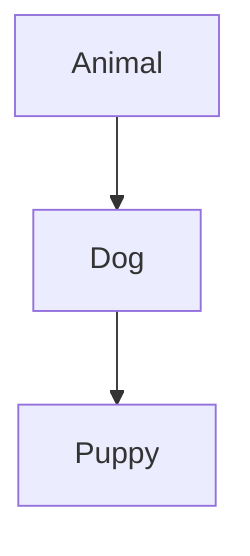

# Important Questions 1 - C# and Dotnet Tools

## Same Questions as Assignment 1

21,17,11,9,7,16 are exempted.

### Q1.List some popular client scripting languages and explain them.

Client side scripting languages are programming languages where the heavy processing happens client side, usually on the client application or on the web browser itself. Here are some client side scripting languages:
- HTML
    - Hyper Text Markup Language is a simple scripting language used to create the layout or structure of a web page.
    - Usually works in tandem with CSS for styling and JS for more advance scripting
- CSS
    - Cascading Style Sheets allow the developer to create the style, look, and feel of the page.
    - It allows you to customize the font, border styles, format, margins, paddings, etc
- JS
    - Javascript is a lightweight interpreted(or sometimes JIT compiled) language with easy to call functions.
    - This allows us to perform more advanced actions in our website/web page.
- React.js
    - React is a JavaScript framework that allows you to create dynamic and responsive web pages
    - Using React Native, we can even develop Android/iOS apps

[Crampete](https://www.crampete.com/blogs/client-side-scripting-top-languages-to-learn/)
### Q2.What is ".NET Framework"?
The .NET Framework is a software framework created by Microsoft for development of Windows Apps.

This provides a set of libraries, tools, and a runtime environment to build apps with programming languages like C#, F#, Visual Basic, etc. With some effort, you can compile to various targets like Windows Desktop, Linux(x11/xWayland), Mac, web, mobile, and even build games using Godot(C# through mono), Unity(C#, Only for scripting), 

- [Wikipedia](https://en.wikipedia.org/wiki/.NET_Framework)
- [GeeksForGeeks](https://www.geeksforgeeks.org/introduction-to-net-framework/)

### Q3.What is "VB.NET"?
Visual Basic(previously known as VisualBasic.NET(VB.NET)) is an object oriented language for .NET, .NET Framewowrk and Mono

It is a successor to VB6 from .NET framework, and it supports OOP concepts like abstraction, encapsulation, inheritance, polymorphism. This means that everything in the language is an object.

It is not a case sensitive language, and is used to quickly develop a full object oriented program with full access to all libraries from the .NET Framework.

- [JavaTPoint](https://www.javatpoint.com/vb-net)
- [TutorialsPoint](https://www.tutorialspoint.com/vb.net/index.htm)
- [Wikipedia](https://en.wikipedia.org/wiki/Visual_Basic_(.NET))
### Q4.Explain web technologies with examples
Web technology is used to describe all the different things people use to make websites and web-based applications. 
- This includes software and hardware tools, programming languages, and standards needed to create and run web apps on the internet. 
- Web technology comprises many areas, including web design, web development, web servers, web browsers, e-commerce, and content management systems.

We can simplify this into these classifications of Web Technology:
- ***Web servers***: 
    - They process requests and send responses to web browsers. Eg. Nginx, caddy, apache, etc
- ***Web browsers***: 
    - They are the tools we use to look at web pages. Eg. Chromium(Chrome, Brave, Edge), Gecko(Firefox), WebKit/WebKitGTK(Gnome Web, Safari) 
- ***HTML***: 
    - It's a language that helps structure and show content on web pages
- ***CSS***: 
    - It helps make web pages look pretty by adding colors, fonts, and styles
- ***JavaScript***: 
    - It's a language that makes web pages do cool stuff like animations and interactive features
- ***Backend Technologies***: 
    - They are the tools used to make the server-side parts of web apps work. Eg. ASP.NET, Golang, Python, Flask, Django, Ruby on Rails, etc
- ***Database Systems***: 
    - They store and retrieve data used in web apps. Eg. MySQL, PostgreSQL, Oracle SQL, NoSQL, etc

- [GeeksForGeeks](https://www.geeksforgeeks.org/backend-technologies/)
- [Naukri](https://www.naukri.com/code360/library/complete-introduction-to-web-technology)
### Q5.Explain the advantages and disadvantages of client side and server-side technologies

#### Pros and Cons of Client-Side Scripting

- Pros:
    - Fast response time, as no server communication is needed.
    - Reduces server load, leading to a more scalable application.
- Cons:
    - Security risks, as the code can be seen and altered by users.
    - May behave differently in different browsers.

#### Pros and Cons of Server-Side Scripting

- Pros:
    - More secure, as the code is not exposed to clients.
    - Consistent across different browsers.
    - Can handle complex processing.
- Cons:
    - Can be slower, as it requires communication with the server.
    - Places more load on the server.

- [Naukri](https://www.naukri.com/code360/library/difference-between-client-side-scripting-and-server-side-scripting)
### Q6.Explain C# Tokens with one example for each
A c# program is basically collection of tokens.

There are five tokens in C#.
- Keywords
    - These are reserved words which are saved for existing things by the language.
    - Example: event, extern, null, etc
- Identifiers
    - Identifier is a name that we give to objects, classes, methods, variables, etc to identify them.
    - Example: hello, a, b, variable1, etc
- Literals
    - Literals are how values in a variable are shown. 
    - Types:
        - Numeric literal
            - Integer literal
            - Real literal
        - Boolean Literal
        - Character Literal
            - Character Literal
            - String literal
        - Example: true is a boolean literal
- operators
    - Operators are symbols used to describe operations between one or more operands
    - Example: + for addition
- punctuators.
    - These are used to seperate, group and format the code.
    - They help in defining the shape of the program
    - Also Known as Seperators
    - Example: ; (semicolon)

[MSDotnet.co.in](https://www.msdotnet.co.in/2013/06/tokens-in-c.html)


### Q8.Define Inheritance and write its types with neat diagram and explain one program
Inheritance is an OOP Concept where we define a class based on another class while bringing over the properties and more from the previous class.

In C#, there are 4 types of inheritance:
- Single inheritance: 
    - A derived class that inherits from only one base class.
    ```mermaid
    graph TD;
    A[BaseClass] --> B[DerivedClass]
    ```
- Multi-level inheritance: 
    - A derived class that inherits from a base class and the derived class itself becomes the base class for another derived class.
    ```mermaid
    graph TD;
    A[BaseClass] --> B[DerivedClass1]
    B --> C[DerivedClass2]
    ```
- Hierarchical inheritance: 
    - A base class that serves as a parent class for two or more derived classes.
    ```mermaid
    graph TD;
    A[BaseClass] --> B[DerivedClass1]
    A --> C[DerivedClass2]
    A --> D[DerivedClass3]
    ```
- Multiple inheritance: 
    - A derived class that inherits from two or more base classes.
    ```mermaid
    graph TD;
    A[BaseClass1] --> D[DerivedClass]
    B[BaseClass2] --> D[DerivedClass]
    ```

Program:
```C#
using System;

// Base class
class Animal {
    public void Speak() {
        Console.WriteLine("Animal speaks");
    }
}

// Derived class (Single Inheritance)
class Dog : Animal {
    public void Bark() {
        Console.WriteLine("Dog barks");
    }
}

// Derived class (Multi-level Inheritance)
class Puppy : Dog {
    public void Whine() {
        Console.WriteLine("Puppy whines");
    }
}

class Program {
    static void Main() {
        Puppy puppy = new Puppy();
        puppy.Speak(); // Inherited from Animal
        puppy.Bark();  // From Dog
        puppy.Whine(); // From Puppy
    }
}
```



- **Animal** is the base class.
- **Dog** inherits from **Animal** (Single Inheritance).
- **Puppy** inherits from **Dog** (Multi-level Inheritance).

[GeeksForGeeks](https://www.geeksforgeeks.org/c-sharp-inheritance/)

### Q10.List the data types of C# programming
| Data Type | Size | Description |
|--|--|--|
| int| 4 bytes | Stores whole numbers from -2,147,483,648 to 2,147,483,647|
| long  | 8 bytes | Stores whole numbers from -9,223,372,036,854,775,808 to 9,223,372,036,854,775,807|
| float | 4 bytes | Stores fractional numbers. Sufficient for storing 6 to 7 decimal digits|
| double | 8 bytes | Stores fractional numbers. Sufficient for storing 15 decimal digits|
| bool | 1 bit | Stores true or false values|
| char | 2 bytes | Stores a single character/letter, surrounded by single quotes|
| string | 2 bytes per character | Stores a sequence of characters, surrounded by double quotes|

[Geeks For Geeks](https://www.w3schools.com/cs/cs_data_types.php) 
### Q12.Explain types of operators with an example of each
Operators are tokens we use to perform operations with one, two or more operands. Types of Operators are:
- Arithmetic Operators
    - Addition: The ‘+’ operator adds two operands. 
        - For example, x+y.
    - Subtraction: The ‘-‘ operator subtracts two operands. 
        - For example, x-y.
    - Multiplication: The ‘*’ operator multiplies two operands. 
        - For example, x*y.
    - Division: The ‘/’ operator divides the first operand by the second. 
        - For example, x/y.
    - Modulus: The ‘%’ operator returns the remainder when first operand is divided by the second.      
        - For example, x%y.
- Relational Operators
    - ‘=='(Equal To) operator checks whether the two given operands are equal or not. 
        - If so, it returns true. 
        - Otherwise it returns false. 
        - For example, 5==5 will return true.
    - ‘!='(Not Equal To) operator checks whether the two given operands are equal or not. 
        - If not, it returns true. 
        - Otherwise it returns false. 
        - For example, 5!=5 will return false.
    - ‘>'(Greater Than) operator checks whether the first operand is greater than the second operand. 
        - If so, it returns true. 
        - Otherwise it returns false. 
        - For example, 6>5 will return true.
    - ‘<‘(Less Than) operator checks whether the first operand is lesser than the second operand. 
        - If so, it returns true. 
        - Otherwise it returns false. 
        - For example, 6<5 will return false.
    - ‘>='(Greater Than Equal To) operator checks whether the first operand is greater than or equal to the second operand. 
        - If so, it returns true. 
        - Otherwise it returns false. 
        - For example, 5>=5 will return true.
    - ‘<='(Less Than Equal To) operator checks whether the first operand is lesser than or equal to the second operand. 
        - If so, it returns true. 
        - Otherwise it returns false. 
        - For example, 5<=5 will also return true.
- Logical Operators
    - Logical AND: 
        - The ‘&&’ operator returns true when both the conditions in consideration are satisfied. 
        - Otherwise it returns false. 
        - For example, a && b returns true when both a and b are true (i.e. non-zero).
    - Logical OR: 
        - The ‘||’ operator returns true when one (or both) of the conditions in consideration is satisfied. 
        - Otherwise it returns false. 
        - For example, a || b returns true if one of a or b is true (i.e. non-zero). 
    - Logical NOT: 
        - The ‘!’ operator returns true the condition in consideration is not satisfied. 
        - Otherwise it returns false. 
        - For example, !a returns true if a is false, i.e. when a=0.
- Assignment Operators
    - “=”(Simple Assignment): This is the simplest assignment operator. This operator is used to assign the value on the right to the variable on the left.
    - Example: 
        - a = 10;

    - “+=”(Add Assignment): This operator is combination of ‘+’ and ‘=’ operators. This operator first adds the current value of the variable on left to the value on the right and then assigns the result to the variable on the left.
    - Example:
        - (a += b) can be written as (a = a + b)

    - “-=”(Subtract Assignment): This operator is combination of ‘-‘ and ‘=’ operators. This operator first subtracts the current value of the variable on left from the value on the right and then assigns the result to the variable on the left.
    - Example: 
        - (a -= b) can be written as (a = a - b)

    - “*=”(Multiply Assignment): This operator is combination of ‘*’ and ‘=’ operators. This operator first multiplies the current value of the variable on left to the value on the right and then assigns the result to the variable on the left.
    - Example: 
        - (a *= b) can be written as (a = a * b)

    - “/=”(Division Assignment): This operator is combination of ‘/’ and ‘=’ operators. This operator first divides the current value of the variable on left by the value on the right and then assigns the result to the variable on the left.
    - Example: 
        - (a /= b) can be written as (a = a / b)

    - “%=”(Modulus Assignment): This operator is combination of ‘%’ and ‘=’ operators. This operator first modulo the current value of the variable on left by the value on the right and then assigns the result to the variable on the left.
    - Example: 
        - (a %= b) can be written as (a = a % b)

- Conditional Operators
- Unary Operators
    - Increment: 
        - The ‘++’ operator is used to increment the value of an integer. 
        - For example, x++.
    - Decrement: 
        - The ‘- -‘ operator is used to decrement the value of an integer. 
        - For example, x- –.
- Ternary Operators

[GeeksForGeeks](https://www.geeksforgeeks.org/c-sharp-operators)
### Q13. What is the Difference between client side and server-side programming?
### Q14.List the features of C# and explain them
### Q15.List the features of VB.NET and explain
### Q18.Define try and catch block with an example program
### Q19.Explain different types of arrays in c#
### Q20.Explain Mutable and Immutable strings in c#

## Source:
- Questions - given by faculty
