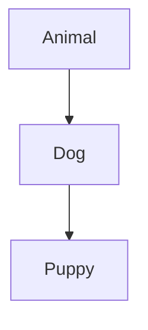
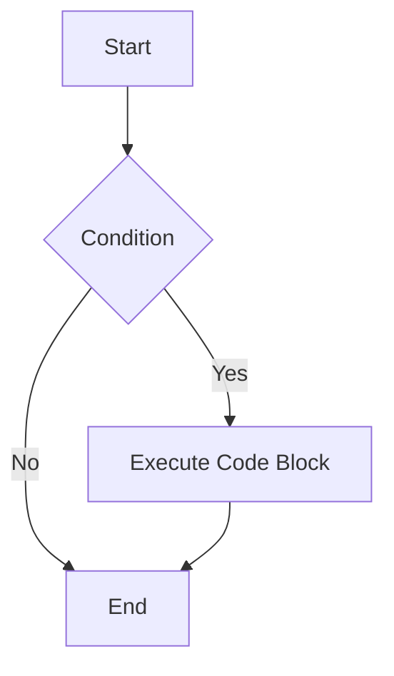
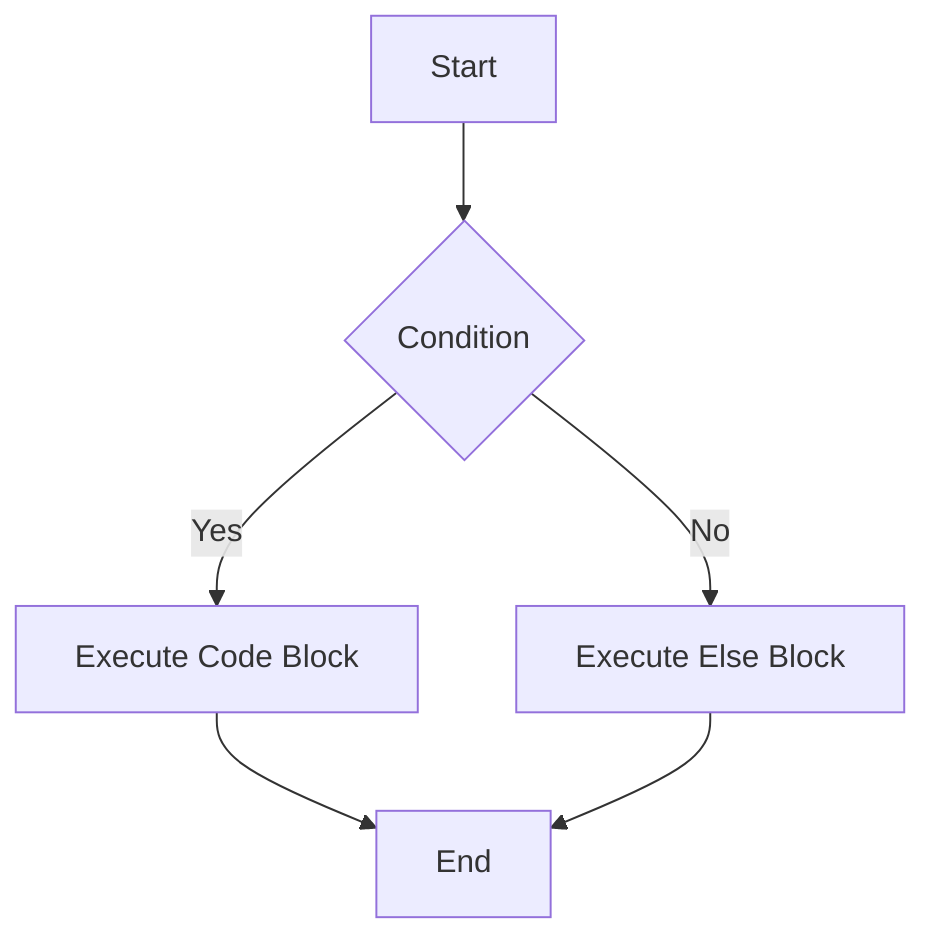
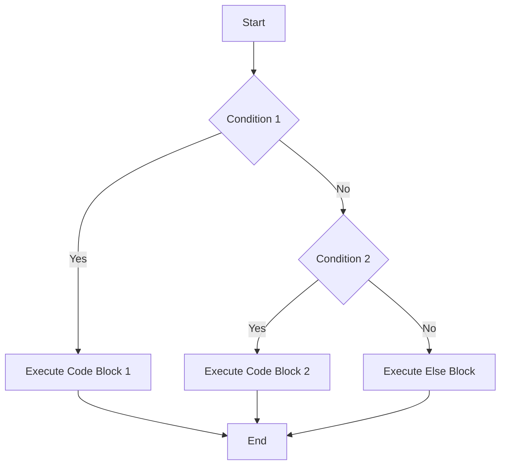
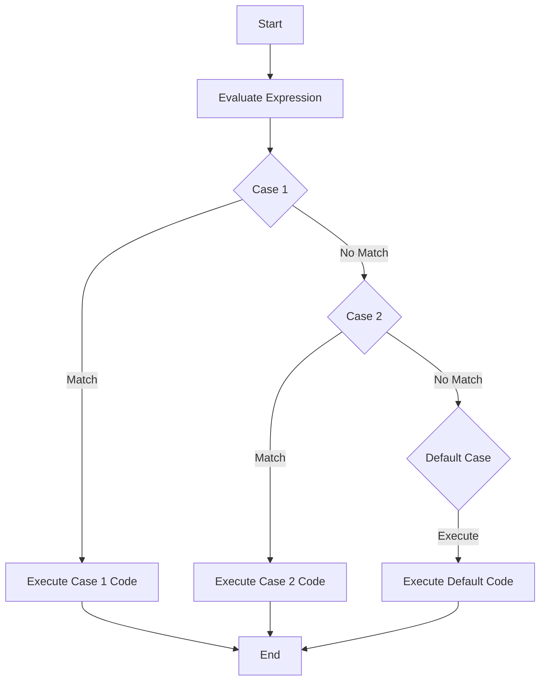

# Important Questions 1 - C# and Dotnet Tools

Same Questions as Assignment 1

<!--21,17,11,9,7,16 are exempted.-->

## Q1.List some popular client scripting languages and explain them.

Client side scripting languages are programming languages where the heavy processing happens client side, usually on the client application or on the web browser itself. Here are some client side scripting languages:
- HTML
    - Hyper Text Markup Language is a simple scripting language used to create the layout or structure of a web page.
    - Usually works in tandem with CSS for styling and JS for more advance scripting
- CSS
    - Cascading Style Sheets allow the developer to create the style, look, and feel of the page.
    - It allows you to customize the font, border styles, format, margins, paddings, etc
- JS
    - Javascript is a lightweight interpreted(or sometimes JIT compiled) language with easy to call functions.
    - This allows us to perform more advanced actions in our website/web page.
- React.js
    - React is a JavaScript framework that allows you to create dynamic and responsive web pages
    - Using React Native, we can even develop Android/iOS apps

[Crampete](https://www.crampete.com/blogs/client-side-scripting-top-languages-to-learn/)
## Q2.What is ".NET Framework"?
The .NET Framework is a software framework created by Microsoft for development of Windows Apps.

This provides a set of libraries, tools, and a runtime environment to build apps with programming languages like C#, F#, Visual Basic, etc. With some effort, you can compile to various targets like Windows Desktop, Linux(x11/xWayland), Mac, web, mobile, and even build games using Godot(C# through mono), Unity(C#, Only for scripting), 

- [Wikipedia](https://en.wikipedia.org/wiki/.NET_Framework)
- [GeeksForGeeks](https://www.geeksforgeeks.org/introduction-to-net-framework/)

## Q3.What is "VB.NET"?
Visual Basic(previously known as VisualBasic.NET(VB.NET)) is an object oriented language for .NET, .NET Framewowrk and Mono

It is a successor to VB6 from .NET framework, and it supports OOP concepts like abstraction, encapsulation, inheritance, polymorphism. This means that everything in the language is an object.

It is not a case sensitive language, and is used to quickly develop a full object oriented program with full access to all libraries from the .NET Framework.

- [JavaTPoint](https://www.javatpoint.com/vb-net)
- [TutorialsPoint](https://www.tutorialspoint.com/vb.net/index.htm)
- [Wikipedia](https://en.wikipedia.org/wiki/Visual_Basic_(.NET))
## Q4.Explain web technologies with examples
Web technology is used to describe all the different things people use to make websites and web-based applications. 
- This includes software and hardware tools, programming languages, and standards needed to create and run web apps on the internet. 
- Web technology comprises many areas, including web design, web development, web servers, web browsers, e-commerce, and content management systems.

We can simplify this into these classifications of Web Technology:
- ***Web servers***: 
    - They process requests and send responses to web browsers. Eg. Nginx, caddy, apache, etc
- ***Web browsers***: 
    - They are the tools we use to look at web pages. Eg. Chromium(Chrome, Brave, Edge), Gecko(Firefox), WebKit/WebKitGTK(Gnome Web, Safari) 
- ***HTML***: 
    - It's a language that helps structure and show content on web pages
- ***CSS***: 
    - It helps make web pages look pretty by adding colors, fonts, and styles
- ***JavaScript***: 
    - It's a language that makes web pages do cool stuff like animations and interactive features
- ***Backend Technologies***: 
    - They are the tools used to make the server-side parts of web apps work. Eg. ASP.NET, Golang, Python, Flask, Django, Ruby on Rails, etc
- ***Database Systems***: 
    - They store and retrieve data used in web apps. Eg. MySQL, PostgreSQL, Oracle SQL, NoSQL, etc

- [GeeksForGeeks](https://www.geeksforgeeks.org/backend-technologies/)
- [Naukri](https://www.naukri.com/code360/library/complete-introduction-to-web-technology)
## Q5.Explain the advantages and disadvantages of client side and server-side technologies

#### Pros and Cons of Client-Side Scripting

- Pros:
    - Fast response time, as no server communication is needed.
    - Reduces server load, leading to a more scalable application.
- Cons:
    - Security risks, as the code can be seen and altered by users.
    - May behave differently in different browsers.

#### Pros and Cons of Server-Side Scripting

- Pros:
    - More secure, as the code is not exposed to clients.
    - Consistent across different browsers.
    - Can handle complex processing.
- Cons:
    - Can be slower, as it requires communication with the server.
    - Places more load on the server.

- [Naukri](https://www.naukri.com/code360/library/difference-between-client-side-scripting-and-server-side-scripting)
## Q6.Explain C# Tokens with one example for each
A c# program is basically collection of tokens.

There are five tokens in C#.
- Keywords
    - These are reserved words which are saved for existing things by the language.
    - Example: `event`, `extern`, `null`, etc
- Identifiers
    - Identifier is a name that we give to objects, classes, methods, variables, etc to identify them.
    - Example: `hello`, `a`, `b`, `variable1`, etc
- Literals
    - Literals are how values in a variable are shown. 
    - Types:
        - Numeric literal
            - Integer literal
            - Real literal
        - Boolean Literal
        - Character Literal
            - Character Literal
            - String literal
        - Example: true is a boolean literal
- operators
    - Operators are symbols used to describe operations between one or more operands
    - Example: `+` for addition
- punctuators.
    - These are used to seperate, group and format the code.
    - They help in defining the shape of the program
    - Also Known as Seperators
    - Example: `;` (semicolon)

[MSDotnet.co.in](https://www.msdotnet.co.in/2013/06/tokens-in-c.html)

## Q7. Explain the OOP Concept in C#
TODO: Solve

## Q8.Define Inheritance and write its types with neat diagram and explain one program
Inheritance is an OOP Concept where we define a class based on another class while bringing over the properties and more from the previous class.

In C#, there are 4 types of inheritance:
- Single inheritance: 
    - A derived class that inherits from only one base class.
    ```mermaid
    graph TD;
    A[BaseClass] --> B[DerivedClass]
    ```
- Multi-level inheritance: 
    - A derived class that inherits from a base class and the derived class itself becomes the base class for another derived class.
    ```mermaid
    graph TD;
    A[BaseClass] --> B[DerivedClass1]
    B --> C[DerivedClass2]
    ```
- Hierarchical inheritance: 
    - A base class that serves as a parent class for two or more derived classes.
    ```mermaid
    graph TD;
    A[BaseClass] --> B[DerivedClass1]
    A --> C[DerivedClass2]
    A --> D[DerivedClass3]
    ```
- Multiple inheritance: 
    - A derived class that inherits from two or more base classes.
    ```mermaid
    graph TD;
    A[BaseClass1] --> D[DerivedClass]
    B[BaseClass2] --> D[DerivedClass]
    ```

Program:
```C#
using System;

// Base class
class Animal {
    public void Speak() {
        Console.WriteLine("Animal speaks");
    }
}

// Derived class (Single Inheritance)
class Dog : Animal {
    public void Bark() {
        Console.WriteLine("Dog barks");
    }
}

// Derived class (Multi-level Inheritance)
class Puppy : Dog {
    public void Whine() {
        Console.WriteLine("Puppy whines");
    }
}

class Program {
    static void Main() {
        Puppy puppy = new Puppy();
        puppy.Speak(); // Inherited from Animal
        puppy.Bark();  // From Dog
        puppy.Whine(); // From Puppy
    }
}
```



- **Animal** is the base class.
- **Dog** inherits from **Animal** (Single Inheritance).
- **Puppy** inherits from **Dog** (Multi-level Inheritance).

[GeeksForGeeks](https://www.geeksforgeeks.org/c-sharp-inheritance/)

## Q9. Explain control structures with syntax and flow chart in C#
C# has the following conditional statements:

- if:
    - Use `if` to specify a block of code to be executed, if a specified condition is true
- if else:
    - Use `else` to specify a block of code to be executed, if the same condition is false
- else if:
    - Use `else` if to specify a new condition to test, if the first condition is false
- switch:
    - Use `switch` to specify many alternative blocks of code to be executed

#### If statement:
Use the `if` statement to specify a block of C# code to be executed if a condition is `True`.




Syntax:
```C#
if (condition) 
{
  // block of code to be executed if the condition is True
}
```
Example:
```C#
if (20 > 18) 
{
  Console.WriteLine("20 is greater than 18");
}
```

#### Else Statement:

Use the `else` statement to specify a block of code to be executed if the condition is `False`.



Syntax:
```C#
if (condition)
{
  // block of code to be executed if the condition is True
} 
else 
{
  // block of code to be executed if the condition is False
}
```

Example:
```C#
if (20 < 18) 
{
  Console.WriteLine("20 is less than 18");
} 
else 
{
  Console.WriteLine("20 is more than 18");
}
```

Ternary Operation:
- The shorthand for if-else is `(condition)?Result1:Result2;`
#### Else-if Statement:

Use the `else if` statement to specify a new condition if the first condition is `False` and fallback to else if that is also false.



Syntax:
```C#
if (condition1)
{
  // block of code to be executed if condition1 is True
} 
else if (condition2) 
{
  // block of code to be executed if the condition1 is false and condition2 is True
} 
else
{
  // block of code to be executed if the condition1 is false and condition2 is False
}
```

Example:
```C#
if (20 < 18) 
{
  Console.WriteLine("20 is less than 18");
} 
else if(30 < 20)
{
    Console.WriteLine("30 is less than 20");
}
else 
{
  Console.WriteLine("20 is more than 18");
}
```
#### Switch Statement:
Use the `switch` statement to select one of many code blocks to be executed.



Syntax:
```C#
switch(expression) 
{
  case x:
    // code block
    break;
  case y:
    // code block
    break;
  default:
    // code block
    break;
}
```

Example:
```C#
int day = 4;
switch (day) 
{
  case 1:
    Console.WriteLine("Monday");
    break;
  case 2:
    Console.WriteLine("Tuesday");
    break;
  case 3:
    Console.WriteLine("Wednesday");
    break;
  case 4:
    Console.WriteLine("Thursday");
    break;
  case 5:
    Console.WriteLine("Friday");
    break;
  case 6:
    Console.WriteLine("Saturday");
    break;
  case 7:
    Console.WriteLine("Sunday");
    break;
}
```

The break Keyword
- When C# reaches a `break` keyword, it breaks out of the switch block.

The default Keyword
- The `default` keyword is optional and specifies some code to run if there is no case match
    - this can be compared to the else keyword in if-else statements
<!-- if, if else, if else if, switch, etc -->

[W3Schools](https://www.w3schools.com/cs/cs_conditions.php)
## Q10.List the data types of C# programming
| Data Type | Size | Description |
|--|--|--|
| int| 4 bytes | Stores whole numbers from -2,147,483,648 to 2,147,483,647|
| long  | 8 bytes | Stores whole numbers from -9,223,372,036,854,775,808 to 9,223,372,036,854,775,807|
| float | 4 bytes | Stores fractional numbers. Sufficient for storing 6 to 7 decimal digits|
| double | 8 bytes | Stores fractional numbers. Sufficient for storing 15 decimal digits|
| bool | 1 bit | Stores true or false values|
| char | 2 bytes | Stores a single character/letter, surrounded by single quotes|
| string | 2 bytes per character | Stores a sequence of characters, surrounded by double quotes|

[GeeksForGeeks](https://www.w3schools.com/cs/cs_data_types.php) 

## Q11. Explain the different types of lists tags with examples
Lists (`<ul>`, `<ol>`, `<li>`): 
    - Lists allow you to organize items in bullet points (`<ul>`) or numbered order (`<ol>`). Each item within a list is wrapped in `<li>` tags.

There are three types of lists in HTML
- Unordered list or Bulleted list (ul)
    - Here, the list just shows up as bulleted points
    - Example:
        ```HTML
        <ul>
           <li>Apple</li>
           <li>Mango</li>
           <li>Banana</li>
           <li>Grapes</li>
           <li>Orange</li>
        </ul>
        ```
- Ordered list or Numbered list (ol)
    - Here, the list shows up as numbered entries. You can also have roman numerals by using `<ol type="i">` 
    - Example:
        ```HTML
        <ol>
           <li>Apple</li>
           <li>Mango</li>
           <li>Banana</li>
           <li>Grapes</li>
           <li>Orange</li>
        </ol>
        ```
- Description list or Definition list (dl)
    - You can use a description list to display items like a glossary. You will need the following HTML tags to create a description list:
        - `<dl>` (Definition list) tag 
            - Start tag of the definition list
        - `<dt>` (Definition Term) tag 
            - It specifies a term (name)
        - `<dd>` tag (Definition Description) 
            - Specifies the term definition
        - `</dl>` tag (Definition list)
            - Closing tag of the definition list
    - Example:
        ```HTML
        <dl>
           <dt><b>Apple</b></dt>
           <dd>A red colored fruit</dd>
           <dt><b>Honda</b></dt>
           <dd>A brand of a car</dd>
           <dt><b>Spinach</b></dt>
           <dd>A green leafy vegetable</dd>
        </dl>
        ```

[Shiksha](https://www.shiksha.com/online-courses/articles/html-lists-ordered-unordered-lists-with-examples/)

[GeeksForGeeks](https://www.geeksforgeeks.org/html-course-structure-of-an-html-document/)
## Q12.Explain types of operators with an example of each
Operators are tokens we use to perform operations with one, two or more operands. Types of Operators are:
- Arithmetic Operators
    - Addition: The `+` operator adds two operands. 
        - For example, `x+y`.
    - Subtraction: The `-` operator subtracts two operands. 
        - For example, `x-y`.
    - Multiplication: The `*` operator multiplies two operands. 
        - For example, `x*y`.
    - Division: The `/` operator divides the first operand by the second. 
        - For example, `x/y`.
    - Modulus: The `%` operator returns the remainder when first operand is divided by the second.      
        - For example, `x%y`.
- Relational Operators
    - `==`(Equal To) operator checks whether the two given operands are equal or not. 
        - If so, it returns true. 
        - Otherwise it returns false. 
        - For example, `5==5` will return true.
    - `!=`(Not Equal To) operator checks whether the two given operands are equal or not. 
        - If not, it returns true. 
        - Otherwise it returns false. 
        - For example, `5!=5` will return false.
    - `>`(Greater Than) operator checks whether the first operand is greater than the second operand. 
        - If so, it returns true. 
        - Otherwise it returns false. 
        - For example, `6>5` will return true.
    - `<`(Less Than) operator checks whether the first operand is lesser than the second operand. 
        - If so, it returns true. 
        - Otherwise it returns false. 
        - For example, `6<5` will return false.
    - `>=`(Greater Than Equal To) operator checks whether the first operand is greater than or equal to the second operand. 
        - If so, it returns true. 
        - Otherwise it returns false. 
        - For example, `5>=5` will return true.
    - `<=`(Less Than Equal To) operator checks whether the first operand is lesser than or equal to the second operand. 
        - If so, it returns true. 
        - Otherwise it returns false. 
        - For example, `5<=5` will also return true.
- Logical Operators
    - Logical AND: 
        - The `&&` operator returns true when both the conditions in consideration are satisfied. 
        - Otherwise it returns false. 
        - For example, `a && b` returns true when both a and b are true (i.e. non-zero).
    - Logical OR: 
        - The `||` operator returns true when one (or both) of the conditions in consideration is satisfied. 
        - Otherwise it returns false. 
        - For example, `a || b` returns true if one of a or b is true (i.e. non-zero). 
    - Logical NOT: 
        - The `!` operator returns true the condition in consideration is not satisfied. 
        - Otherwise it returns false. 
        - For example, `!a` returns true if a is false, i.e. when a=0.
- Assignment Operators
    - `=`(Simple Assignment): This is the simplest assignment operator. This operator is used to assign the value on the right to the variable on the left.
    - Example: 
        - `a = 10`;

    - `+=`(Add Assignment): This operator is combination of `+` and `=` operators. This operator first adds the current value of the variable on left to the value on the right and then assigns the result to the variable on the left.
    - Example:
        - `a += b` can be written as `a = a + b`

    - `-=`(Subtract Assignment): This operator is combination of ‘-‘ and ‘=’ operators. This operator first subtracts the current value of the variable on left from the value on the right and then assigns the result to the variable on the left.
    - Example: 
        - `a -= b` can be written as `a = a - b`

    - `*=`(Multiply Assignment): This operator is combination of `*` and `=` operators. This operator first multiplies the current value of the variable on left to the value on the right and then assigns the result to the variable on the left.
    - Example: 
        - `a *= b` can be written as `a = a * b`

    - `/=`(Division Assignment): This operator is combination of `/` and `=` operators. This operator first divides the current value of the variable on left by the value on the right and then assigns the result to the variable on the left.
    - Example: 
        - `a /= b` can be written as `a = a / b`

    - `%=`(Modulus Assignment): This operator is combination of `%` and `=` operators. This operator first modulo the current value of the variable on left by the value on the right and then assigns the result to the variable on the left.
    - Example: 
        - `a %= b` can be written as `a = a % b`

- Unary Operators
    - Increment: 
        - The `++` operator is used to increment the value of an integer.
        - This is equivalent to `x=x+1`
        - For example, `x++`
    - Decrement: 
        - The `--` operator is used to decrement the value of an integer.
        - This is equivalent to `x=x-1` 
        - For example, `x--`.
- Ternary Operators is a shorthand version of if-else statement. 
    - It has three operands and hence the name ternary. 
    - It will return one of two values depending on the value of a Boolean expression. 
    - Syntax:
        `condition ? first_expression : second_expression;`
    - Eg.  `c = a>b?a:b;` 
    Here, C will take on the value of the larger variable.

[GeeksForGeeks](https://www.geeksforgeeks.org/c-sharp-operators)
## Q13. What is the Difference between client side and server-side programming?
#### Server-side Programming :

It is the program that runs on server dealing with the generation of content of web page.
1) Querying the database
2) Operations over databases
3) Access/Write a file on server.
4) Interact with other servers.
5) Structure web applications.
6) Process user input. For example if user input is a text in search box, run a search algorithm on data stored on server and send the results.

#### Client-side Programming :

It is the program that runs on the client machine (browser) and deals with the user interface/display and any other processing that can happen on client machine like reading/writing cookies.

1) Interact with temporary storage
2) Make interactive web pages
3) Interact with local storage
4) Sending request for data to server
5) Send request to server
6) work as an interface between server and user

[GeeksForGeeks](https://www.geeksforgeeks.org/server-side-client-side-programming/)
## Q14.List the features of C# and explain them

Here are some features of C#:
1) Simple
    - C# is a simple language in the sense that it provides structured approach (to break the problem into parts), rich set of library functions, data types etc.
2) Modern Programming Language
    - C# programming is based upon the current trend and it is very powerful and simple for building scalable, interoperable and robust applications.
3) Object Oriented
    - C# is object oriented programming language. OOPs makes development and maintenance easier where as in Procedure-oriented programming language it is not easy to manage if code grows as project size grow.
4) Type Safe
    - C# type safe code can only access the memory location that it has permission to execute. Therefore it improves a security of the program.
5) Interoperability
    - Interoperability process enables the C# programs to do almost anything that a native C++ application can do.
6) Scalable and Updateable
    - C# is automatic scalable and updateable programming language. For updating our application we delete the old files and update them with new ones.
7) Component Oriented
    - C# is component oriented programming language. It is the predominant software development methodology used to develop more robust and highly scalable applications.
8) Structured Programming Language
    - C# is a structured programming language in the sense that we can break the program into parts using functions. So, it is easy to understand and modify.
9) Rich Library
    - C# provides a lot of inbuilt functions that makes the development fast.
10) Fast Speed
    - The compilation and execution time of C# language is fast.

[JavaTPoint](https://www.javatpoint.com/csharp-features)
## Q15.List the features of VB.NET and explain them
Visual Basic is a high-level programming language with many features to develop a secure and robust application. 

- Here are some features:
    - It is an object-oriented programming language that follows various oops concepts such as abstraction, encapsulation, inheritance, and many more. 
        - It means that everything in VB.NET programming will be treated as an object.
    - This language is used to design user interfaces for window, mobile, and web-based applications.
    - It supports a rapid application development tool kit. In which a developer does not need to write all the codes as it can get various code automatically from its libraries. For example, when we create a form in Visual basic.net, it automatically calls events of various form in that class.
    - It is not a case sensitive language like other languages such as C++, java, etc.
    - It supports Boolean condition for decision making in programming.
    - It also supports the multithreading concept, in which you can do multiple tasks at the same time.
    - It provides simple events management in .NET application.
    - A Window Form enables us to inherit all existing functionality of form that can be used to create a new form. So, in this way, it reduced the code complexity.
    - It uses an external object as a reference that can be used in a VB.NET application.
    - Automatic initialized a garbage collection.
    - It follows a structured and extensible programming language for error detection and recovery.
    - Conditional compilation and easy to use generic classes.
    - It is useful to develop web, window, and mobile applications.

[JavaTPoint](https://www.javatpoint.com/vb-net)

## Q16. Write a basic structure of an HTML program
HTML documents are text files that contains structured code which tells browsers how to display a webpage.
- These documents are made up of HTML tags which define elements like headers, paragraphs, images, links, and more.

```HTML
<!DOCTYPE html>
<html lang="en">
  
<head>
    <meta charset="UTF-8" />
    <meta name="viewport" content=
        "width=device-width, initial-scale=1.0" />
    <title>Structure of HTML Document</title>
</head>

<body>
    <!-- Main content of website -->
    <h1>BCA-Students</h1>
    <p>A one-stop place for solved questions</p>
</body>

</html>
```

As we can see, the document has the following elements:
- `<!DOCTYPE HTML>`: 
    - The `<!DOCTYPE html>` declaration is placed at the beginning of the document. 
    - It tells the browser that the document follows HTML5 standards, ensuring consistent rendering across browsers.
- `<html>` Tag: 
    - The `<html>` tag wraps the entire document, serving as the root element of an HTML page. 
    - It typically includes the lang attribute to specify the language of the content.
- `<head>` Section: 
    - The `<head>` section contains metadata, scripts, styles, and other information not displayed directly on the page but essential for functionality and SEO.
- `<body>` Section: 
    - The `<body>` section contains all the visible content of the web page, including text, images, videos, links, and more. 
    - This is where you’ll add the main elements to display on the page.

[GeeksForGeeks](https://www.geeksforgeeks.org/html-course-structure-of-an-html-document/)

## Q17. List the different types of languages supported in .NET Framework
Popular .NET Programming Languages are:
- C#
    - C# (pronounced "C sharp") is a simple, modern, object-oriented, and type-safe programming language.
    - Its roots in the C family of languages makes C# immediately familiar to C, C++, Java, and JavaScript programmers.
- F#
    - F# (pronounced "F sharp") is a programming language that makes it easy to write brief, robust, and performant code.
- Visual Basic
    - Visual Basic is an approachable language with a simple syntax for building type-safe, object-oriented apps.

[Microsoft](https://dotnet.microsoft.com/en-us/languages)
## Q18.Define try and catch block with an example program
When executing C# code, different errors can occur: coding errors made by the programmer, errors due to wrong input, or other unforeseeable things.

When an error occurs, C# will normally stop and generate an error message which means C# will throw an exception (throw an error).

- The `try` statement allows you to define a block of code to be tested for errors while it is being executed.
- The `catch` statement allows you to define a block of code to be executed, if an error occurs in the try block.

Syntax: 
```C#
try 
{
  //  Block of code to try
}
catch (Exception e)
{
  //  Block of code to handle errors
}
```

Program: 
```C#
using System;
					
public class Program
{
	public static void Main()
	{
		try
		{
			int[] myNumbers = {1,2,3};
			Console.WriteLine(myNumbers[10]);
		}
	
		catch (Exception e)
		{
 			 Console.WriteLine(e.Message);
		}
	}
}
```

Output: 
> Index was outside the bounds of the array. 

[W3Schools](https://www.w3schools.com/cs/cs_exceptions.php)
## Q19.Explain different types of arrays in c#
There are three types of arrays in C#, which are
- Single-dimensional Array
    - a single-dimensional array is a data structure that stores elements of the same data type in a linear sequence. 
    - Each element in the array is accessed by its index, starting from zero.
    - Eg. 
        ```C#
        int[] arr = new int[10];
        ```

        ```C#
        int[] myNum = {10, 20, 30, 40};
        ```
- Multi-dimensional Array
    - Multi-dimensional arrays in C# are arrays that hold data in more than one dimension, allowing for efficient storage and manipulation of complex data structures.
    - These arrays can be thought of as matrices or tables, providing rows and columns to organize and access elements based on multiple indices.
    - Eg.
        ```C#
        int[,] numbers = { {1, 4, 2}, {3, 6, 8} };
        ```
- Jagged Array
    - In C#, a jagged array is an array of arrays where each element can hold arrays of different sizes. 
    - Unlike regular multi-dimensional arrays, jagged arrays allow for flexible and uneven lengths, making them ideal for storing complex data structures 
    - Eg. 
        ```C#
        int[][] jaggedArray = new int[2][];
        jaggedArray[0] = new int[4];
        jaggedArray[1] = new int[6];
        jaggedArray[0] = new int[] { 4, 6, 8, };
        jaggedArray[1] = new int[] { 1, 0, 2, 4, 6 };
        ```

[ScholarHat](https://www.scholarhat.com/tutorial/csharp/types-of-array-in-csharp)
## Q20.Explain Mutable and Immutable strings in c#

> Mutable and immutable are English words that mean "can change" and "cannot change" respectively. 

That means the mutable types are those whose data members can be changed after the instance is created but Immutable types are those whose data members can not be changed after the instance is created.

When we change the value of mutable objects, value is changed in same memory. But in immutable type, the new memory is created and the modified value is stored in new memory.

#### String

Strings are immutable, which means we are creating new memory every time instead of working on existing memory.

#### StringBuilder

StringBuilder is a mutable type, that means we are using the same memory location and keep on appending/modifying the stuff to one instance. It will not create any further instances hence it will not decrease the performance of the application.

[C-SharpCorner](https://www.c-sharpcorner.com/article/mutable-and-immutable-class-in-c-sharp/)

## Q21. Explain about Interfaces 
TODO: Solve
# Source:
- Questions - given by faculty
