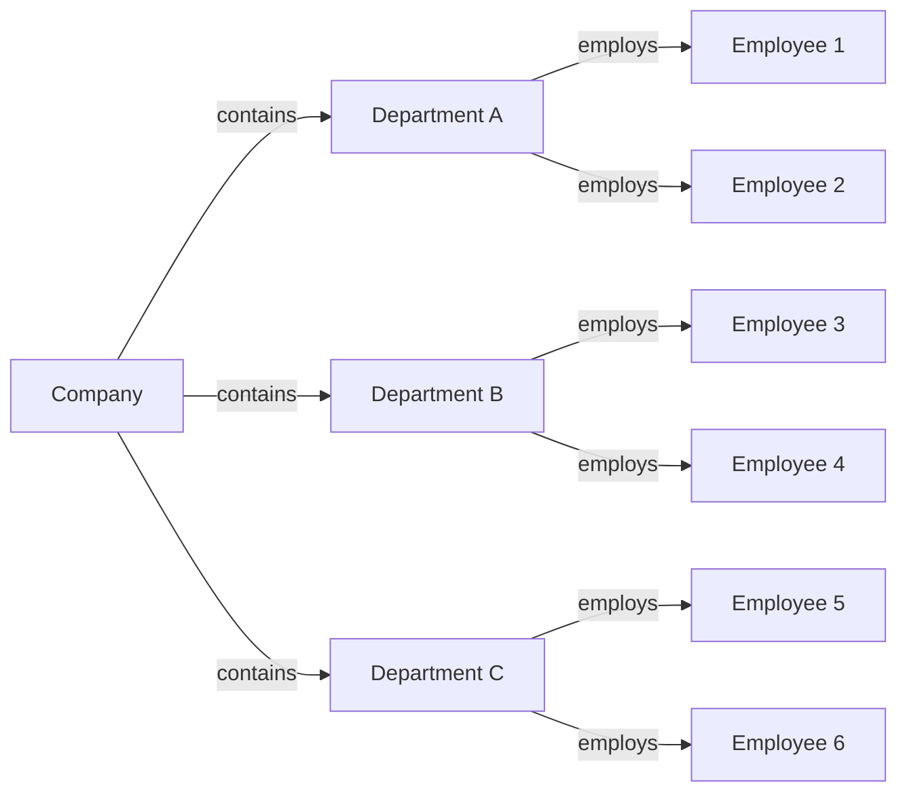

# Unit 1: Database Architecture

## Important Questions

### Q1. define database.

A database is a collection of data that is structured and easy to access, manage and update. This can be anything like text, numbers, videos, images, files, and more.

### Q2. Define DBMS

A DBMS(Database Management System) is a software used to manage data in a database. This allows us to store, modify, update and delete data from a database.

Examples: MySQL, Oracle SQL, MongoDB, PostgreSQL, etc

[GeeksForGeeks](https://www.geeksforgeeks.org/dbms/)

### Q3. Why do we need DBMS?

A DBMS makes the following tasks a lot simpler:
- Data Organization and Management
    - A well-designed database schema enables faster access to information, reducing the time required to find relevant data. 
    - A DBMS also provides features like indexing and searching, which make it easier to locate specific data within the database. 
- Data Security and Privacy
    - They offer authentication and authorization features that control access to the database. 
    - DBMSs also provide encryption capabilities to protect sensitive data from unauthorized access. 
- Data Integrity and Consistency
    - DBMSs provide mechanisms that ensure the accuracy and consistency of data. 
    - These mechanisms include constraints, triggers, and stored procedures that enforce data integrity rules
- Concurrent Data Access
    - DBMS provides a concurrent access mechanism that allows multiple users to access the same data simultaneously.
    - DBMSs use locking mechanisms to ensure that multiple users can access the same data without causing conflicts or data corruption.

[GeeksForGeeks](https://www.geeksforgeeks.org/need-for-dbms/)
### Q4. Define data model.
A Data Model is a blueprint-like representation of the data so that we can visualize and understand it.

[AWS](https://aws.amazon.com/what-is/data-modeling/#:~:text=Data%20modeling%20is%20the%20process,store%20and%20analyze%20the%20data.)
### Q5. Explain relational model.
A relational data model is where we use Tables to describe how our data is stored in a Relational Databases. Rows are called Tuples and Columns are called Attributes.  

| **Student ID** | **Name** | **Age** | **Field** |
| --- | --- | --- | --- |
| 1 | John Smith | 20 | Computer Science |
| 2 | Jane Doe | 21 | Biology |
| 3 | Bob Johnson | 19 | Mathematics |

Here, Student ID, Name, Age and Field come under Attributes(columns) and the Tuples(rows) hold student data corresponding to the attributes. 

[GeeksForGeeks](https://www.geeksforgeeks.org/relational-model-in-dbms/)

### Q6. Explain Hierarchical model.
In a hierarchical model, data is organized in a tree-like structure which helps group multiple tables together.

Here, Company is the root node, The departments are parent nodes and the employees are the child nodes.

- Node: A single entity or record in the hierarchical structure.
- Parent node: The node that is one level above a given node in the hierarchical structure.
- Child node: The node that is one level below a given node in the hierarchical structure.
- Root node: The topmost node in the hierarchical structure.

[GeeksForGeeks](https://www.geeksforgeeks.org/hierarchical-model-in-dbms/)

### Q7. What is a schema?
A database schema is basically the structure of the relational database, so it defines how the data is organized.

This includes primary key, tuples, attributes, tables, fields, data types, relations and constraints.

[GeeksForGeeks](https://www.geeksforgeeks.org/database-schemas/)

[IBM](https://www.ibm.com/topics/database-schema)
### Q8. What is an instance?
A Database instance is the collection of all the data stored at any given time. This is also called the current state, or database state. 

[GeeksForGeeks](https://www.geeksforgeeks.org/instance-in-database)
### Q9. What is DBMS architecture?
A DBMS (Database Management System) architecture refers to the overall design and organization of a DBMS, including the components, interfaces, and interactions between them. It provides a framework for managing and accessing data in a database.

[Javatpoint](https://www.javatpoint.com/dbms-architecture)
### Q10. What is data independence?
Data independence is a property of a database management system by which we can change the database schema at one level of the database system without changing the database schema at the next higher level. 

It has two types:
- Physical Data Independence 
- Logical Data Independence

[GeeksForGeeks](https://www.geeksforgeeks.org/what-is-data-independence-in-dbms/)
### Q11. Define database language.
Database Language is a programming language used to define and manipulate a database.

It has 4 types based on what it does:
- DDL - Data Definition Language
    - CREATE
    - ALTER
    - DROP
    - TRUNCATE
    - COMMENT
    - RENAME
- DML - Data Manipulation Language
    - INSERT
    - UPDATE
    - DELETE
    - MERGE
    - CALL
- DQL - Data Query Language 
    - SELECT
- DCL - Data Control Language
    - GRANT
    - REVOKE
- TCL - Transaction Control Language
    - COMMIT
    - ROLLBACK
    - SAVEPOINT
    - AUTOCOMMIT

[Scalar](https://www.scaler.com/topics/database-languages-in-dbms/)
### Q12. What are the properties of database?

### Q13. Explain different types of database users.

### Q14. What are the disadvantages of database?

### Q15. Explain different people in DBMS.

### Q17. Explain different types of schemas.

### Q18. Explain different types of DBMS architectures.

### Q19. What is database Representation? Explain different types with examples

### Q20. What is the difference between logical and physical data independence? Explain briefly.

## Source:
- Questions: Dictated in class